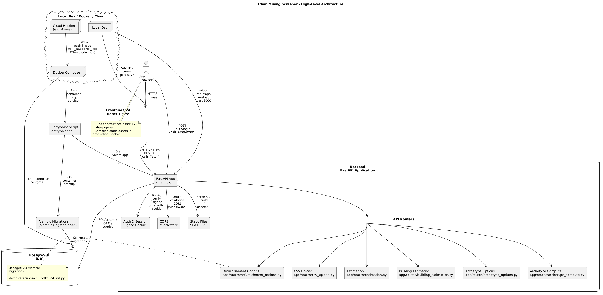

# Architecture

This document describes the end-to-end architecture of the Urban Mining Screener (UMS): a Vite-based Single-Page Application (SPA) communicating with a FastAPI backend and a PostgreSQL database. It covers static serving in production/Docker, authentication via signed cookies, CORS, the request lifecycle, database migrations, and typical deployment topologies.

- SPA (frontend) → FastAPI (backend) → PostgreSQL (DB)
- Static assets are served by the backend in Docker/production
- Authentication uses a signed cookie
- CORS allows local development origins and selected cloud domains
- Database schema managed by Alembic migrations at startup in container environments

Diagram:

## Components Overview

- Frontend (SPA):
  - Framework: React + Vite
  - Dev server: http://localhost:5173
  - Production build generated during Docker image build and served by backend (see [`Dockerfile`](../Dockerfile))

- Backend (FastAPI):
  - Application entry: [`main.py`](../main.py)
  - Dev server: uvicorn on port 8000
  - CORS, auth cookie, static serving configuration in [`main.py`](../main.py)
  - Environment/Settings: [`app/config.py`](../app/config.py)

- Database (PostgreSQL):
  - Default dockerized service (Compose)
  - Schema managed by Alembic migrations at container startup via [`entrypoint.sh`](../entrypoint.sh)
  - Initial schema migration: [`alembic/versions/c668fc8fc00d_init.py`](../alembic/versions/c668fc8fc00d_init.py)

## Authentication (Signed Cookie)

UMS uses a simple password-based login that issues a signed cookie. Authentication is required for protected routes (CSV ingestion, estimation, building estimation, archetype operations).

- Login endpoint: [`main.py:auth_login()`](../main.py:98)
- Logout endpoint: [`main.py:auth_logout()`](../main.py:118)
- Session status endpoint: [`main.py:auth_status()`](../main.py:125)
- Cookie configuration:
  - Name: `ums_auth`
  - Signed with itsdangerous `URLSafeSerializer` using `AUTH_SECRET`
  - Cookie security depends on ENV (see Cookie behavior in Configuration)

Cookie security rules:
- production (ENV=production): `secure=True`, `SameSite="none"` (requires HTTPS)
- development/docker: `secure=False`, `SameSite="lax"`

Helper:
- `_is_cookie_secure()` toggles based on ENV: [`main.py`](../main.py:75)

## CORS

CORS is configured to support local development and selected cloud origins.

Configured in code:
- Middleware setup: [`main.py`](../main.py:138)
- Allow list includes localhost dev origins (5173, 3000, 8080)
- Credentials allowed, all methods/headers permitted for dev convenience

Environment variables:
- `CORS_ORIGINS`, `CORS_ORIGIN_REGEX` are defined in settings for possible future use:
  - [`app/config.py`](../app/config.py:35)

See also the detailed configuration notes in [docs/configuration.md](configuration.md).

## API Routers
OpenAPI docs are available at `/docs`: configured in [`main.py`](../main.py:62).

## Security Considerations

- Required secrets:
  - `APP_PASSWORD`, `AUTH_SECRET` must be set; application fails fast if missing: [`app/config.py`](../app/config.py:49)
- Cookies:
  - Use HTTPS in production to satisfy browser requirements for `Secure` cookies
- CORS:
  - Dev-friendly configuration is permissive; validate production origin policies
- Data inputs:
  - CSV ingestion endpoints are protected by session cookie

## Observability and Operations

- Logging:
  - The application uses Python logging throughout utils and routers
  - Docker logs: `docker compose logs -f app`
- Health:
  - `/health` endpoint available when static mount is active: [`main.py`](../main.py:175)
- Versioning:
  - API title/version from settings: [`app/config.py`](../app/config.py:25)

## Related Documentation

- Installation: [docs/installation.md](installation.md)
- Configuration: [docs/configuration.md](configuration.md)
- Data Model: [docs/data-model.md](data-model.md)
- Sources & Licensing: [docs/sources.md](sources.md)
- OSM ODbL Compliance: [docs/osm-odbl-compliance.md](osm-odbl-compliance.md)
- Pulse Archetypes: [docs/archetypes-pulse.md](archetypes-pulse.md)