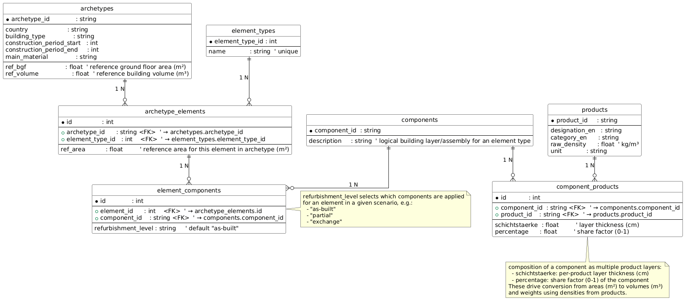

# Data Model

This document describes the Urban Mining Screener (UMS) database entities, relationships, and how they map to the estimation logic. It references the initial Alembic migration and the utility code that computes factors, areas, and volumes. It also explains the conversion-factor model translating areas (m²) to volumes (m³) using thickness h and percentage shares A%.

Authoritative schema reference:
- Initial migration: [alembic/versions/c668fc8fc00d_init.py](../alembic/versions/c668fc8fc00d_init.py)
- Container-time migrations: [entrypoint.sh](../entrypoint.sh)

Core utilities referenced here:
- Area estimator: [app/utils/area_estimator.py:estimate_target_areas()](../app/utils/area_estimator.py:36)
- Volume calculator: [app/utils/volume_calculator.py:calculate_material_volumes_weights()](../app/utils/volume_calculator.py:16)
- Factor calculator: [app/utils/factor_calculator.py:calculate_reference_factors()](../app/utils/factor_calculator.py:16)
- Estimation constants (element sets): [app/utils/estimation_constants.py:estimation_constants()](../app/utils/estimation_constants.py:1)

Related endpoints:
- Material estimation API: [app/routes/estimation.py:estimate_building_materials()](../app/routes/estimation.py:211)
- Building estimation API: [app/routes/building_estimation.py:estimate_building_values_endpoint()](../app/routes/building_estimation.py:139)

## ER Model Overview

The schema is initialized by the Alembic “init” migration. Entities and tables:

1) archetypes
- PK: archetype_id (string)
- Attributes: country, building_type, construction_period_start, construction_period_end, main_material
- Reference metrics:
  - ref_bgf (float): reference ground floor area (m²)
  - ref_volume (float): reference building volume (m³)
- Usage:
  - Drives factor derivation and scaling of internal wall volumes

2) element_types
- PK: element_type_id (int, autoincrement)
- name (string, unique index)
- Examples: “Ground floor”, “External walls”, “Roof”, “Windows”, “Internal walls …”
- Usage:
  - Categorizes elements and steers algorithmic branches (e.g., horizontal vs vertical vs internal walls) via constants in [app/utils/estimation_constants.py:estimation_constants()](../app/utils/estimation_constants.py:1)

3) archetype_elements
- PK: id (int, autoincrement)
- FKs:
  - archetype_id → archetypes.archetype_id
  - element_type_id → element_types.element_type_id
- ref_area (float): reference area for this element type in the archetype (m²)
- Usage:
  - Sum of ref_area by element type is used to compute proportions and factors (e.g., retaining walls factor, roof factor, window factor) in [app/utils/factor_calculator.py:calculate_reference_factors()](../app/utils/factor_calculator.py:16)
  - Also used to proportionally distribute target areas among components in [app/utils/area_estimator.py:estimate_target_areas()](../app/utils/area_estimator.py:36)

4) components
- PK: component_id (string)
- Logical building layers/assemblies for an element type (e.g., external wall assembly, roof assembly)
- Usage:
  - Component composition (products + thickness/percentage) defines how areas convert to volumes and weights

5) component_products
- PK: id (int, autoincrement)
- FKs:
  - component_id → components.component_id
  - product_id → products.product_id
- Attributes:
  - schichtstaerke (float): layer thickness (cm)
  - percentage (float): share factor (0–1)
- Indexes over component_id and product_id
- Usage:
  - Per product thickness and percentage are used to compute volumes/weights in [app/utils/volume_calculator.py:calculate_material_volumes_weights()](../app/utils/volume_calculator.py:16)

6) element_components
- PK: id (int, autoincrement)
- FKs:
  - element_id → archetype_elements.id
  - component_id → components.component_id
- refurbishment_level (string, default "as-built")
- Usage:
  - Associates which component(s) are used to realize a given element in a specified refurbishment level (e.g., “as-built”, “partial”, “exchange”)
  - The refurbishment selection drives which components are aggregated during estimation

7) products
- PK: product_id (string)
- Attributes:
  - designation_en (string)
  - category_en (string)
  - raw_density (float, kg/m³)
  - unit (string)
- Usage:
  - raw_density converts computed volumes to weights

Indexes and constraints can be reviewed directly in the migration: [alembic/versions/c668fc8fc00d_init.py](../alembic/versions/c668fc8fc00d_init.py)

## Relationships

High-level relationships among entities:

- archetypes 1 — N archetype_elements (by element_type)
- element_types 1 — N archetype_elements
- archetype_elements 1 — N element_components
- components 1 — N element_components
- components 1 — N component_products
- products 1 — N component_products

This structure allows:
- Declaring reference areas per element type for each archetype
- Attaching one or more components to realize an element (depending on refurbishment level)
- Defining each component as a list of product layers with thickness and shares

ER diagram:

## Conversion-Factor Model for Components

The estimation is driven by a linear relation from areas (m²) to volumes (m³), using per-product layer thickness (h, in meters) and composition shares (A%, 0–1):

- For area-based elements (e.g., foundation/floors/roof/external walls/windows):
  - volume_component_product = A_target (m²) × h_m (m) × share
  - where:
    - A_target derives from target_grundflaeche, target_gebaeudeumrisse, target_gebaeudehoehe, and proportional factors
    - h_m = schichtstaerke(cm) / 100
    - share = percentage (0–1)

- For internal-wall-like elements (volume-based scaling):
  - volume_component_product = (ref_area × h_m × share / ref_volume) × target_volume
  - This pattern follows the internal walls branch in [app/utils/volume_calculator.py:calculate_material_volumes_weights()](../app/utils/volume_calculator.py:16)

Element category behavior (driven by constants):
- Horizontal elements (e.g., “Ground floor”, “Attic floor”, “Intermediate floors”):
  - Target area derived ~ proportional to target_grundflaeche and component proportion
- Vertical elements (“External walls”):
  - Target area derived from perimeter × height × (1 − window share) or similar factor usage
- Openings (“Windows” / “Doors”):
  - Window area derived as external wall area × window factor

Exact factor computation is documented here: [app/utils/factor_calculator.py:calculate_reference_factors()](../app/utils/factor_calculator.py:16)

## Reference Areas and Proportions

Proportions per component within an element type are computed using ref_area values in the archetype:

- component_proportion = ref_area_component / total_ref_area_for_element_type
- The total reference area for each element type is accumulated from [archetype_elements] and used in [app/utils/area_estimator.py:estimate_target_areas()](../app/utils/area_estimator.py:36)
- Target areas are then:
  - Horizontal: A_target ≈ component_proportion × target_grundflaeche
  - Retaining walls: A_target ≈ faktor_sm × target_grundflaeche × component_proportion
  - Roof: A_target ≈ faktor_dach × target_grundflaeche × component_proportion
  - External walls/Windows: A_target ≈ perimeter × height × (factor) × component_proportion

Where factors originate from reference element sums (archetype-level constants):
- faktor_sm (retaining walls per ground area)
- faktor_dach (roof per ground area)
- faktor_w (window share over external walls + windows)
- Calculated in: [app/utils/factor_calculator.py:calculate_reference_factors()](../app/utils/factor_calculator.py:16)

## Refurbishment Modeling

The refurbishment level determines which components are applied for each element:

- element_components.refurbishment_level distinguishes “as-built” vs “partial” vs “exchange” (etc.)
- During estimation, refurbishment action rules may alter the assembly selection and target area semantics; see:
  - Rules: [app/utils/refurbishment_rules.py:refurbishment_rules()](../app/utils/refurbishment_rules.py:1)
  - Half-exchange roof combination logic: [app/utils/half_exchange_logic.py:calculate_half_exchange_roof()](../app/utils/half_exchange_logic.py:10)
- Windows can fall back to “as-built” if a refurbishment level lacks entries: [app/utils/window_calculator.py:calculate_window_data()](../app/utils/window_calculator.py:68)

The target area pipeline:
1) Compute per-element-type as-built reference areas (sum ref_area by element_type)
2) Compute component proportions within each element_type using as-built components
3) Derive A_target per component for area-based elements (horizontal, external walls, windows, retaining walls, roof)
4) Assign “refurbishment” component target areas according to rules and as-built totals
5) Feed TargetAreaData into volume calculation

See: [app/utils/area_estimator.py:estimate_target_areas()](../app/utils/area_estimator.py:36)

## Implementation References

- Factor derivation: [app/utils/factor_calculator.py:calculate_reference_factors()](../app/utils/factor_calculator.py:16)
- Area targeting: [app/utils/area_estimator.py:estimate_target_areas()](../app/utils/area_estimator.py:36)
- Volumes & weights: [app/utils/volume_calculator.py:calculate_material_volumes_weights()](../app/utils/volume_calculator.py:16)
- Windows aggregation: [app/utils/window_calculator.py:calculate_window_data()](../app/utils/window_calculator.py:68)
- Rulesets: [app/utils/refurbishment_rules.py:refurbishment_rules()](../app/utils/refurbishment_rules.py:1), [app/utils/half_exchange_logic.py:calculate_half_exchange_roof()](../app/utils/half_exchange_logic.py:10)
- API surfaces: [app/routes/estimation.py:estimate_building_materials()](../app/routes/estimation.py:211), [app/routes/building_estimation.py:estimate_building_values_endpoint()](../app/routes/building_estimation.py:139)