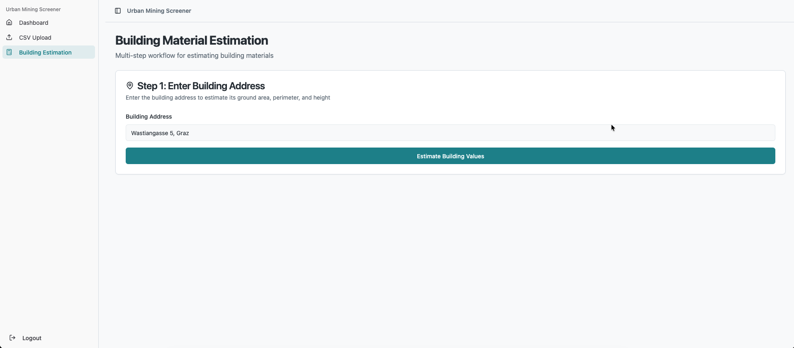
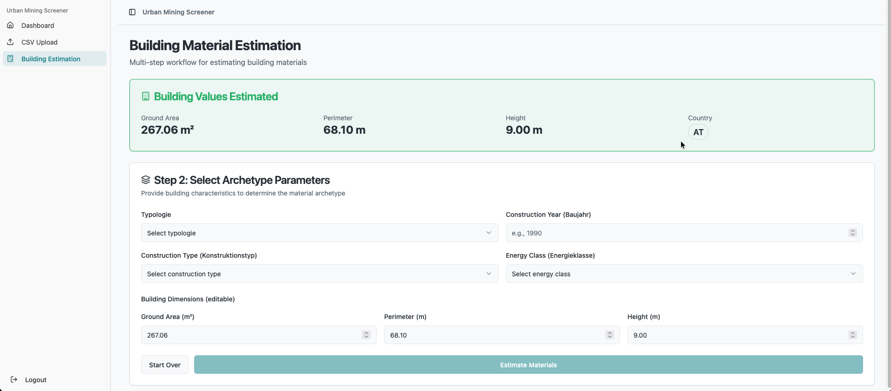
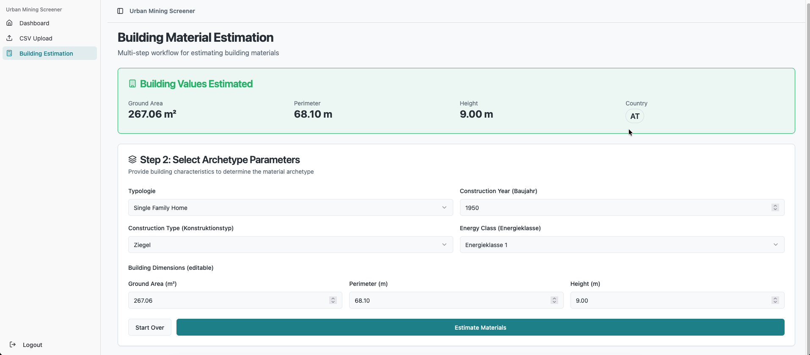
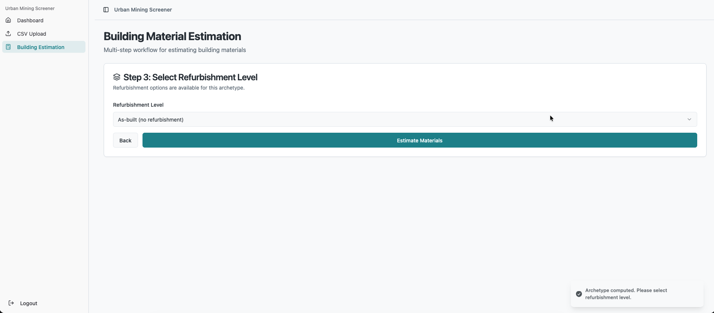
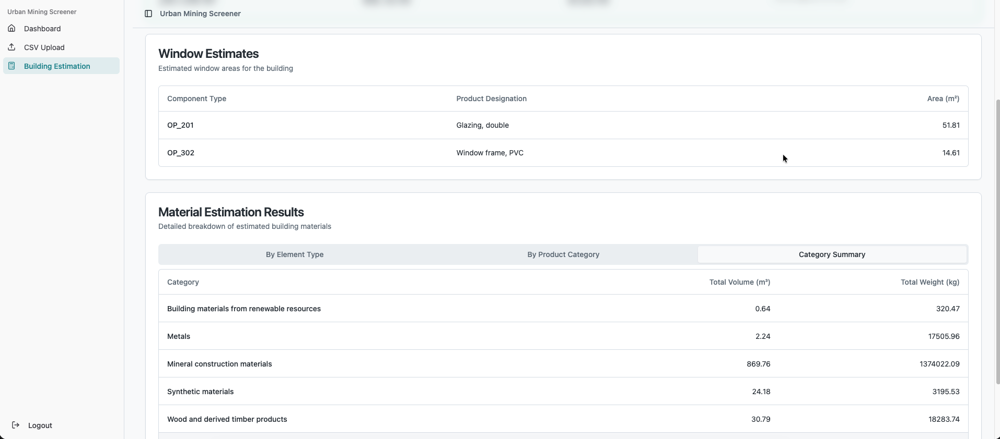
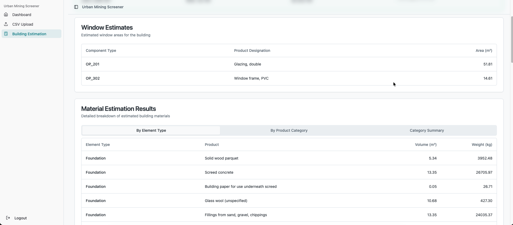
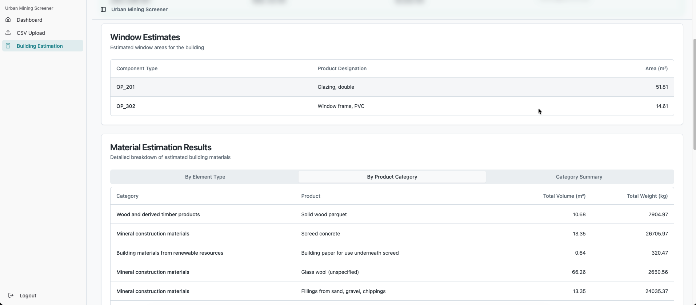

# User Guide

This guide explains the end-to-end user flow “Eingabe Adresse → Auswahl Archetyp → Ergebnis” and how to interpret outputs and export results. It also documents how country detection and archetype selection work, with screenshot placeholders to be added later.

- UI screenshots: placeholders live under [docs/images/](images/). Use [frontend/public/placeholder.svg](../frontend/public/placeholder.svg) as a temporary image where needed.
- OSM attribution: an attribution banner/footnote is required (see [docs/osm-odbl-compliance.md](osm-odbl-compliance.md)).

## Prerequisites (local or Docker)

- Backend is running (dev: http://localhost:8000, Docker: http://127.0.0.1:8000)
- Frontend is running (dev: http://localhost:5173; Docker: served by backend at /)
- Authentication: The application uses a simple password-based login issuing a signed cookie, see [`main.py:auth_login()`](../main.py:98).
  - In development/docker: SameSite=Lax, Secure=False
  - In production: SameSite=None, Secure=True (HTTPS required)
  - Details in: [docs/configuration.md](configuration.md)

## 1) Eingabe Adresse (Enter Address)

1. In the “Building Estimation” view, enter a full address (e.g., “Stephansplatz 1, 1010 Wien, Austria”).
2. Trigger the estimation to retrieve building footprint metrics (ground area, perimeter) and height when available.
3. Under the hood:
   - The backend endpoint: [`app/routes/building_estimation.py:estimate_building_values_endpoint()`](../app/routes/building_estimation.py:139)
   - Country detection for the address: [`app/routes/archetype_compute.py`](../app/routes/archetype_compute.py) (e.g., `resolve_country_code`)
   - External data sources: OSM/Overpass, elevation/height where available (see [docs/sources.md](sources.md))

Expected output from this step:
- Ground floor area (Grundfläche, m²)
- Building perimeter (Gebäudeumfang, m)
- Building height (Gebäudehöhe, m) if data available
- Country code (ISO), used for archetype selection and validation

Screenshots:

## 2) Compute Archetyp

1. After country detection, insert needed data to compute archetype.
2. Compute/resolve archetype for inputs: [`app/routes/archetype_compute.py`](../app/routes/archetype_compute.py)
3. Archetypes are aligned to the Pulse baseline (AT, 2024); see extension guidance in [docs/archetypes-pulse.md](archetypes-pulse.md).

Notes:
- Archetype data carries reference areas/volumes used to scale to target building metrics.

Screenshot:

## 3) Refurbishment Level (optional, if applicable)

1. After the archetype has been computed, the system inspects the components used in that archetype to determine whether refurbishment levels are available.
2. If refurbishment options exist for the selected archetype, the UI shows a “Refurbishment Level” step:
   - One option is always **“As-built (no refurbishment)”**, which keeps the building in its current state.
   - Additional levels (e.g. “light”, “medium”, “deep”) may appear depending on the archetype and `element_components` entries.
3. Choose the desired refurbishment level:
   - “As-built (no refurbishment)” → estimate materials using the baseline as-built components.
   - Other levels → apply the refurbishment rules from [`app/utils/refurbishment_rules.py:get_refurbishment_action()`](../app/utils/refurbishment_rules.py:38) and [`app/utils/half_exchange_logic.py:calculate_half_exchange_roof()`](../app/utils/half_exchange_logic.py:10) to modify the component selection.
4. If no refurbishment options are available for the archetype, this step is skipped and the system estimates materials directly based on the as-built configuration.

The available refurbishment levels are discovered via:

- [`app/routes/refurbishment_options.py:get_refurbishment_options()`](../app/routes/refurbishment_options.py:1)

Screenshot:

## 4) Ergebnis (Run Estimation and View Results)

1. Once the refurbishment level is confirmed (or if no refurbishment step was needed), the system runs the material estimation:
   - Endpoint: [`app/routes/estimation.py:estimate_building_materials()`](../app/routes/estimation.py:211)
   - The request may include a `refurbishment_level` matching the selection from Step 3.
2. The results view includes:
   - By element type and product: volumes (m³) and weights (kg).
   - Aggregation by product category.
   - Window/door data where available.
   - Calculation factors for transparency (e.g., roof/wall/window factors).

Screenshots:

## Interpreting Results

The estimation logic scales reference archetype data to the target building:

- Area-based elements (e.g., foundations, floors, roofs, external walls, windows):
  - Target area A_target is derived from address-based metrics and linear proportions.
  - Volumes are calculated as: volume = A_target × thickness × share
- Internal walls (volume-based):
  - Volumes scale with the ratio target_volume / reference_volume
- Windows/Doors:
  - Window areas are a fraction of external wall areas times a window factor
  - Product area aggregations use component thickness and percentage shares

Relevant utilities:
- Area estimation: [`app/utils/area_estimator.py:estimate_target_areas()`](../app/utils/area_estimator.py:36)
- Volumes & weights: [`app/utils/volume_calculator.py:calculate_material_volumes_weights()`](../app/utils/volume_calculator.py:16)
- Factors from archetype: [`app/utils/factor_calculator.py:calculate_reference_factors()`](../app/utils/factor_calculator.py:16)
- Windows data: [`app/utils/window_calculator.py:calculate_window_data()`](../app/utils/window_calculator.py:68)
- Refurbishment rules: [`app/utils/refurbishment_rules.py:get_refurbishment_action()`](../app/utils/refurbishment_rules.py:38)
- Half-exchange logic: [`app/utils/half_exchange_logic.py:calculate_half_exchange_roof()`](../app/utils/half_exchange_logic.py:10)

## CSV Export and Schema

If the UI provides CSV export for results, the expected schema generally includes:
- By element type and product:
  - product_id, product_designation, element_type, volume_m3, weight_kg
- By product category (aggregated):
  - product_id, product_designation, category, total_volume_m3, total_weight_kg
- Factors:
  - roof_factor, window_factor, retaining_walls_factor, reference_areas, reference_volume
- Window data (if exported):
  - product_id, designation, total_product_area (unit as defined by window calculation path)

## Country Detection and Archetype Selection

- Country detection:
  - When you submit an address, the system attempts to resolve an ISO country code. See [`app/routes/building_estimation.py:estimate_building_values_endpoint()`](../app/routes/building_estimation.py:139) and [`app/routes/archetype_compute.py`](../app/routes/archetype_compute.py).
- Archetype selection:
  - compute flow in [`app/routes/archetype_compute.py`](../app/routes/archetype_compute.py) to propose the best-fit archetype based on country, typology, construction period, energy class, etc.
  - The Pulse dataset (2024 baseline) is the reference for initial coverage; see [docs/archetypes-pulse.md](archetypes-pulse.md) for regional extension.

## Authentication and Session

- Login is required to access protected endpoints:
  - POST `/auth/login` with body `{ "password": "<APP_PASSWORD>" }`
  - Cookie name: `ums_auth` (signed with `AUTH_SECRET`)
  - See cookie issuance in [`main.py:auth_login()`](../main.py:98)
- Cookie behavior:
  - Development/docker: SameSite=Lax, Secure=False
  - Production: SameSite=None, Secure=True (requires HTTPS)
- CORS:
  - Local origins like http://localhost:5173 are allowed by default; see [`main.py`](../main.py)

## Troubleshooting

- No results after entering address:
  - The address could not be resolved or the building footprint is unavailable. Refer to API responses and logs for details.
- Login fails repeatedly:
  - Ensure APP_PASSWORD is correctly configured and that cookies are not blocked by the browser policy for your environment (see [docs/configuration.md](configuration.md)).
- CORS errors in browser console:
  - For local dev, ensure frontend runs on http://localhost:5173 and backend on http://localhost:8000.
- SPA calls wrong backend in Docker:
  - Production endpoint is compiled at build time via `VITE_BACKEND_URL` in [`Dockerfile`](../Dockerfile). Rebuild with the desired URL.

## Related Documentation

- Installation: [docs/installation.md](installation.md)
- Configuration: [docs/configuration.md](configuration.md)
- Architecture: [docs/architecture.md](architecture.md)
- Data Model: [docs/data-model.md](data-model.md)
- Sources & Licensing: [docs/sources.md](sources.md)
- Extending Archetypes (Pulse): [docs/archetypes-pulse.md](archetypes-pulse.md)